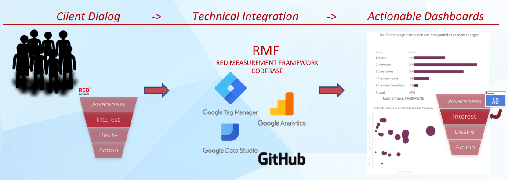

RED Measurement Framework
=======

## Outline

The RED Measurement Framework (RMF) is a collection of javascript code that is to be implemented in a browser based measurement system for tracking of events on websites in the aim of segmenting users based on their behavior. 

It's intentionally meant to integrate and work with the following:

* Google Tag Manager (GTM) 
* Google Analytics (GA)
* Google Data Studio (GDS)
* jQuery

## Integration visualised


## Functional resume

As can be seen from the /dist/measurement-framework.js file, a structured set of operations coupled with the use of a standardized and generic naming convention ensures desired functionality. 

Basically outlined, the above allows for the placement of consumers in segments based on consumer behavior, by utilizing cookie based data and accumulating (n) number of (x,y or z) events. The events used can be defined independently, but it is recommended to use generic event names, as this increases scalability significantly. 

Exemplary segments could be:

* Aware
* Interested
* Considering 
* Store Visit Intent 
* Ecommerce Intent
* Ecommerce Purchase

## The backbone of RMF

The following files can be found in the lib folder and are the backbone of the RMF. The below list presents these files and explains their functional intent.

* **ajaxComplete.js (jQuery)**
	* A set of operations that configures the tracking of asynchronous javascript and xml (AJAX).   
		 
* **clientIdSetter.js**
	* An operation that fetches the client ID (a numeric value that will be added to every call towards GA).
		 
* **contentEngaged.js**
	* A set of operations to measure consumer engagement based on i.e. clicks, movement, scrolls etc. A predetermined threshold (usually between 15-20 seconds of activty) defines when a consumer is considered engaged in page content or not.

* **customTask.js**
	* A set of operations that utilizes the recently released task API from Universal Analytics, which lets you modify a dispathed payload fired to GA. Enabling the sending of i.e. client ID to GA.  

* **domReady.js**
	* A set of operations that allows document object model (DOM) ready events to be fired to GA via callback funtionality. (**needs cofirmation from Asim**)

* **klarnaCheckout.js**
	* An operation that lets you track stages in klarnacheckouts, i.e. shipping address changed, order total changed and cannot complete order.

* **sendHitTask.js**
	* A set of operations that lets us overwrite the initial hitPayLoad in the measurement protocol request sent to GA servers. 

* **userTrail.js**
	* A set of operations that relies on the use of cookies to store consumer web based actions leading to segmentation of consumers.

## Optimal usage
As mentioned in the Outline section of this README, RMF is build to integrate and work with GTM, GA, GDS and jQuery. Therefore, it is recommended to use standardized procedures in all of the above to ensure validity in collected data and increase scalability of use.

In GA it is important to follow best practice when setting up accounts, as this will impact how RMF data will migrate with GA. This cannot be stressed enough. The following link is a guideline for what a GA audit might consist of:

[GA Audit Checklist] (https://www.distilled.net/resources/google-analytics-audit-checklist/)

Having successfully migrated the RMF data in GA it's recommended to use GDS to visualise the collected data. A link is provided below in which a GDS template is shared in a view link. 

Currently the below link is NOT including any data in its charts, albeit a future commit will follow, in which the link will be updated to include data.

[GDS Template] (https://datastudio.google.com/open/1UyxbaJ8fWvwnE5llwyv2Ad1NeJvlZx5C)

The following screenshots show how data sources are added to or removed from the GDS report.  


The next screenshots show how to add data sources. The first screenshot shows the first step in adding data to the GDS report. Choosing a data source, plain and simple, albeit to configure GDS to work optimally, you must either choose a dimension or add another "temporary" data source, then delete it, as shown in the second screenshot, because then you can save your added data source.


The final screenshots show the last steps in adding data sources, the two data sources used at RED Dentsu X and the edit and remove options.


   
## Installation
A chronological list is provided below - explaining the installation of RMF:

- Make sure you have installed npm. 
- Run ```npm init``` (makes a package.json file)
- Run ```npm install i measurement-framework```
- Copy rollup.config.js to the root directory, from the measurement-framework folder placed within the node-modules folder.
- From rollup-config.js remove referances to and import of elsint
- From the measurement-framework folder placed within the node-modules foler, copy the devdependencies in the package.json file and paste in package.json file in the root directory. 
- run ```npm install```

#### Compressing the measurement-framework.js code for GTM
Finally, to compress the measurement-framework.js file, run the following:


- run ```rollup -c```


Confirming the compression has been successful, look inside the dist folder.
If the file is there, copy its contents and make a custom html tag in the desired GTM account.
In the custom html section, type the following:

```
<script>
<between the script tags insert the copied compression of measurement-framework.js>
</script>
```

Additionally, the trigger to be used in GTM is "All Pages".

## Note on building with rollup
Rollup and other javascript compilers do not support removing unused methods from classes. This is why the RMF is running several functions instead of importing a class to hold them. Internally, these use the MeasurementFramework class to hold state and to orchestrate between classes. This makes the package nice and tight.

## Honorable mention
This work is heavily inspired by *Simo Ahava's* blog workings. Therefore we'd like to thank him for his continued interest in working with and utilizing the possibilities within Google Analytics and Google Tag Manager to propel data driven digital marketing forward.  